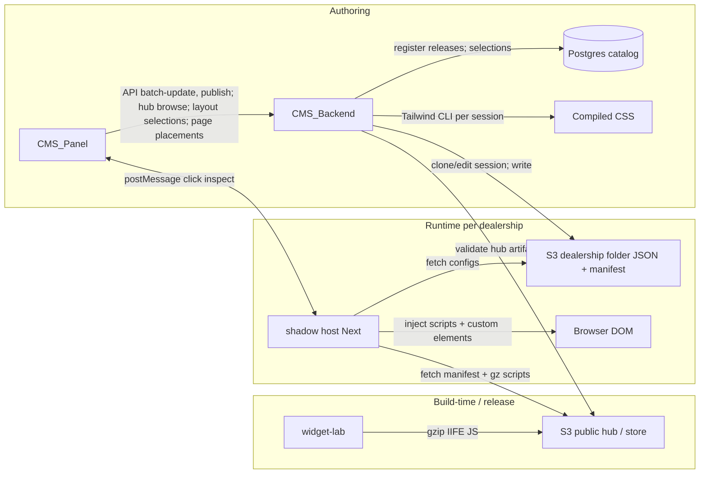

# Centralized CMS & Page Builder — System Architecture

<!--
  AI / documentation metadata (stable anchors for retrieval)
  purpose: multi-tenant dealership sites; JSON-driven content; remote widgets as gzipped IIFE bundles from S3.
  repos: host=shadow Next host | widget-lab=Vite widget builds | backend=Express+Prisma+S3 | panel=Next editor UI
  boundaries: no bespoke UI in host; widgets never embed host code; panel talks to backend; host loads widgets at runtime.
  hub: global Hub Components catalog in Postgres + Hub/Components/* on S3; site-wide selections for layout shell only; page placements + manifest.pages[] for other hub families; Redis catalog cache.
-->

## Quick reference (memory-safe facts)

| Repo | Role | Local path | Package name (npm) | Primary stack |
|------|------|------------|--------------------|---------------|
| Host | Runtime shell per dealership deployment | `/home/rouhollahdev/project/temp/shadow/` | `shadow` | Next 16, React 19, Redux, pako (gzip), Tailwind 4 |
| Widget lab | Build widgets as standalone bundles | `/home/rouhollahdev/project/widget-lab/` | `widget-lab` | Vite (rolldown-vite), React, Tailwind 4, IIFE outputs |
| Backend | S3, sessions, batch JSON edits, Tailwind per dealer, **Hub Components catalog** | `/home/rouhollahdev/project/CMS_Backend/` | `cms-versioning-system` | Express, TypeScript, Prisma, PostgreSQL, Redis, Bull, AWS S3 |
| Panel | Authoring UI, preview, save flows | `/home/rouhollahdev/project/CMS_Panel/` | `panel` | Next 16, React 19, Redux, TanStack Query, Radix |

**Panel → Backend HTTP:** In `CMS_Panel`, server-side proxy routes call **`NEXT_PUBLIC_API_URL`**. That value must be the **API root including `/api/v1`** (e.g. `http://localhost:3002/api/v1`), matching `CMS_Backend` `server.ts` (`app.use('/api/v1', apiRouter)`). Using only the host/port without `/api/v1` will 404 against dealership and website routes.

**Invariant:** Content and layout for pages live primarily in JSON on S3 (per dealership). The Next host redeploy is only for route/container/manifest plumbing changes—not for day-to-day content edits.

---

## What this system is

A **centralized CMS and page builder** that manages **many dealership websites** from shared infrastructure. **Four repositories** cooperate: a thin **host** loads remote **web components** built in **widget-lab**; **backend** owns storage, editing sessions, and compilation hooks; **panel** is the operator-facing editor with preview and save actions.

---

## End-to-end data flow (conceptual)

---

## Glossary (shared vocabulary)

| Term | Meaning |
|------|---------|
| **Manifest** | Describes which widget scripts load on a page (and related routing metadata). Host reads it to know what to fetch. |
| **Widget / web component** | Custom element (`HTMLElement` subclass) that mounts a React root; built as **IIFE**, dependencies resolved from `window`. |
| **Container** | Page-level web component that holds placeholders for child custom tags; actual children hydrate after gz scripts load. |
| **`data-cms`** | Stable DOM attribute used to correlate panel selection ↔ JSON nodes for batch updates. |
| **Hub / store (S3)** | Public area for shared widget `.js.gz` artifacts. **Hub Components** use a structured prefix `Hub/Components/{domainSegment}/{familySegment}/{variantKey}/{version}/` (bundle, manifest, default-config); see [`docs/task-hub-components.md`](docs/task-hub-components.md). |
| **Domain / family / variant / release** | Catalog layers: domain groups families for UX; family is the stable product identity (`tagName`); variant is a design lane; release is an immutable SemVer artifact row pointing at S3 keys. |
| **Site-wide selection** | **`WebsiteComponentSelection`:** per website project, at most one variant/release mode **per hub family**, but **only for layout shell components** (shared chrome: header/footer/nav wrappers—typically catalog **domain `layout`** or an ops-defined layout set). **Not** used for page body widgets. |
| **Page hub placement** | **`WebsiteHubComponentPlacement`:** for **non-layout** hub families, the operator **must** assign a **specific `WebsitePage`** (and optional `order`, `props`, release mode). Drives **`manifest.pages[]`** after sync. |
| **Publish snapshot** | Optional row capturing which hub release was written into the live dealership manifest (`WebsiteHubComponentPublish`), for “what is live?” vs operator intent drift. |
| **Dealership folder (S3)** | Per-tenant JSON configs, manifests, and assets. |
| **Batch update** | Backend API that finds JSON paths via `data-cms` ids and updates sibling keys (structured edit operations). |
| **Context bridge** | Script pattern bridging customized state via `window` listeners / bubbling (works with custom events). |

---

## Project 1 — Host (`shadow`)

**Path:** `/home/rouhollahdev/project/temp/shadow/`

**Responsibility:** One deployable **Next.js** app **per dealership** (or deal). It is the **runtime shell**: routes, manifest loading, gzip fetch/decompress, script injection, and a client **container** that hosts injected widgets.

**Explicit non-goals:** Do **not** implement rich UI, reusable hooks, or shared components here beyond what is needed for hosting (thin atoms/utils only).

**Mechanics (preserve when changing code):**

1. **Page route** follows a fixed pattern: resolve **manifest** → determine which components to load.
2. **Script pipeline:** fetch gzipped bundles → decompress (e.g. `pako`) to JS strings → pass into a **client container** → hook loads scripts into **document head**.
3. **Single bootstrap script** registers the **container custom element** so nested custom tags have a defined upgrade/host lifecycle.
4. **Inter-widget state:** `CustomEvent` on `window` with structured `detail`; listeners filter by target keys. **Context bridge** listens on `window` and rebubbles for Redux-aligned flows.
5. **Bridge to Next:** small utilities / atomic components (e.g. patterns like exposing globals for widgets) connect Next capabilities to web components without coupling widget source to the host repo.

**Skill / AI rule of thumb:** When asked to add a “new page type,” assume manifest + route + container wiring—not new visual UI in `shadow`.

---

## Project 2 — Widget lab (`widget-lab`)

**Path:** `/home/rouhollahdev/project/widget-lab/`

**Responsibility:** Author **widgets** as **custom elements** extending `HTMLElement`, internally using **`createRoot`** (React) for UI.

**Build conventions:**

- **Vite + Rollup options**: externalize/globals so the bundle is **IIFE** and expects peers from **`window`** (aligned with host-injected globals).
- Widgets may call into **Redux actions** or selectors exposed on `window` by the host for cross-cutting app state.
- **Markup contract:** HTML skeleton + **Tailwind class names** + **`data-cms`** ids for panel targeting; **static props** come from **JSON** served per dealership (often via S3), merged into state after mount.

**Artifacts:** One JS bundle per widget → **gzip** → upload under the hub **`Hub/Components/…`** layout (see task-hub-components § contracts). The backend maintains a **Postgres catalog** and exposes browse/register APIs; **CMS_Panel** lists families/variants/releases via those APIs when implementing “Site Components.”

**Page composition:** Each page has a **container** component in the tree; children are custom tag placeholders until scripts load.

**Skill / AI rule of thumb:** New visual features belong here (or in shared JSON schema), not in `shadow`, unless the change is purely host/runtime.

---

## Project 3 — Backend (`cms-versioning-system`)

**Path:** `/home/rouhollahdev/project/CMS_Backend/`

**Responsibility:** **S3 integration**, **session-scoped editing**, **batch JSON updates** keyed by `data-cms`, **Tailwind CSS compilation per dealership session**, provisioning/cloning sites, **Hub Components catalog**, **layout-only site-wide selections**, **page-scoped hub placements**, and API surface for the panel.

**Important behaviors:**

- **Batch update:** Traverse JSON using `data-cms` identifiers; select sibling keys to edit; apply value updates **in session** for responsiveness.
- **Tailwind:** Run Tailwind CLI **per dealership session**; clone dealership JSON/assets from S3 to a **temp workspace** for fast iteration.
- **Shared widgets:** Store **public** widget binaries under a shared S3 prefix usable by all dealerships.
- **Site lifecycle:** Clone from GitHub API (or interim path), run required commands, persist access URL in DB, return to client. **Create** from reference empty template similarly.

### Hub Components catalog (implemented)

**Spec:** [`docs/task-hub-components.md`](docs/task-hub-components.md) (contracts, phases, acceptance). **Status:** backend phases through catalog APIs, manifest extension, copy-on-select, ops APIs, Redis catalog caching, Ajv props validation, and RBAC are implemented per [`docs/task-hub-components-progress.md`](docs/task-hub-components-progress.md).

**Dual source of truth:**

- **S3:** Immutable release folders under `Hub/Components/…` (`bundle.js.gz`, `manifest.json`, `default-config.json`, optional `recommended.json`).
- **PostgreSQL:** `HubComponentDomain` → `HubComponentFamily` → `HubComponentVariant` → `HubComponentRelease`; **layout-only** site intent in **`WebsiteComponentSelection`**; **page-scoped** assignments in **`WebsiteHubComponentPlacement`** (unique per website × page × family); publish-accurate snapshot in `WebsiteHubComponentPublish` where used.

**Policy (product):**

- **Layout hub components** → **site-wide only** (`WebsiteComponentSelection` + manifest **`hubComponents`** / legacy slices). One resolved variant per layout family for the whole site.
- **All other hub components** → **per page** only (`WebsiteHubComponentPlacement` + manifest **`pages[]`** with per-route component lists). The operator must choose **which page** loads each family; there is no site-wide shortcut for non-layout hub usage.

**Operator vs runtime:**

- **Catalog browse** (domains, families, variants, releases): `GET /api/v1/hub/components/…` — authenticated **ADMIN** or **OPERATOR**.
- **Site-wide selection (layouts):** `GET|PUT /api/v1/websites/{dealershipId}/components…` (plus usage helpers such as `…/hub-components/usage`). Panel should restrict this flow to **layout** catalog entries.
- **Page placements (non-layout):** `GET|PUT|DELETE /api/v1/websites/{dealershipId}/pages/{pageId}/hub-components/…` — pick a page, then assign family/variant/release/props/order.
- **Admin / ops:** register release `POST /api/v1/admin/hub/components/releases`, set recommended release, deprecate release (`PATCH`), reverse lookups (`…/releases|variants|families/…/websites`, usage summaries). **Hub manifest sync** (`POST …/hub-manifest/sync` — ADMIN-only) merges resolved hub bundle metadata into the dealership manifest (**`hubComponents`** for layouts + **`pages[]`** for page placements).

**Manifest consumption:** Published dealership manifests carry **`hubComponents`** for **layout shell** loading on every route, and **`pages[]`** (per `WebsitePage` route/slug) so the host knows **which non-layout hub bundles** apply on **which** Next route. Nested **`componentsV2.hubComponents`** may mirror legacy shape where applicable.

**Copy-on-select:** When a site selects or switches variant/version, the backend can copy hub **`default-config.json`** into the dealership tree at **`family.defaultConfigTargetPath`** (under `cms/dealerships/{dealershipExternalId}/…`).

**Performance / consistency:** Catalog list responses may be cached in **Redis** (`HUB_CATALOG_CACHE_TTL_SECONDS`, default short TTL; busted on admin catalog mutations). Selection **`props`** are validated server-side against release **`propsSchema`** (e.g. Ajv) where schema exists.

### Git-backed website lifecycle (current)

**Goal:** keep website source in a git repository per dealership (future: GitHub), while the backend owns cloning into a workspace and running dev/build commands.

- **Repo creation policy**: the backend does **not** create new repositories. A company founder/admin creates an empty repo and shares the remote URL.
- **Repo registration**: panel operator registers the remote URL + default branch + credential against a `WebsiteProject` record.
- **Credentials**: stored **encrypted in Postgres** as `GitCredential` (SSH key or HTTPS PAT). Secrets are never returned to the panel.
- **Clone/sync**: backend clones or fetch+resets into the dealership workspace directory (`/tmp/cms-dealerships/workspace/<dealershipExternalId>/<environment>`).
- **Bootstrap**: `POST /websites/:dealershipId/bootstrap` prefers a registered repo; otherwise it falls back to the default template zip. On success, backend persists `activeUrl/activePort/activePid/projectPath`.
- **Push**: backend can commit+push workspace changes to the registered remote (button-triggered from panel).
- **Deploy policy:** Redeploy Next host only when adding/removing routes or changing hard-coded host behavior—not for JSON-only content changes.

**Roadmap items (from product intent):**

- Harden **version control** with new features.
- **Draft system:** keep edits in backend session until explicit publish (avoid writing partial state straight to S3).
- **Snapshots:** duplicate a site/config to spawn another dealership instance.

**Skill / AI rule of thumb:** Panel saves touch **batch-update** first; “publish” flushes session → dealership folder on S3. Prefer extending session model over ad hoc S3 writes.

---

## Project 4 — Panel (`panel`)

**Path:** `/home/rouhollahdev/project/CMS_Panel/`

**Responsibility:** Editor UX: **iframe preview** of the dev/staging URL from backend, **element inspector**, and persistence actions.

**Preview ↔ host:**

- **`window.postMessage`** between panel and host.
- Host forwards **clicked element metadata** + **computed styles**; panel renders an **element info** sidebar.

**Two save paths:**

1. **Element panel save:** Calls backend **batch-update** to stage changes in the **backend session** (not necessarily S3 yet).
2. **Top-level preview save:** Commits—backend writes **full config** to the **dealership folder on S3**.

**Hub Components UX:** Backend exposes catalog APIs under `/api/v1/hub/components/…`, **layout** site-wide APIs under `/api/v1/websites/{dealershipId}/components/…`, and **page** placement APIs under `/api/v1/websites/{dealershipId}/pages/{pageId}/hub-components/…` (see OpenAPI). Panel should route **layout** domains/families through the site-wide editor and **everything else** through a **page picker** + placement editor; host loads from manifest after sync. **Panel implementation plan:** [`docs/task-hub-panel-components.md`](docs/task-hub-panel-components.md) · **Progress:** [`docs/task-hub-panel-components-progress.md`](docs/task-hub-panel-components-progress.md).

**Composition:** For hub-backed widgets, **which page** a non-layout family appears on is determined by **`WebsiteHubComponentPlacement`** (and `manifest.pages[]`), not by site-wide selection. Legacy **batch-update / page JSON** may still coexist for non-hub widgets until fully migrated.

**Skill / AI rule of thumb:** Any cross-origin messaging or inspector behavior should stay consistent with host expectations—coordinate message shapes with `shadow` when changing selection protocol.

---

## Cross-cutting contracts (for future docs & codegen)

When adding formal docs or agent skills, anchor them here:

| Contract | Owner repo | Suggested doc location |
|----------|------------|-------------------------|
| PostMessage protocol (preview/inspect) | `shadow` + `CMS_Panel` | ADR or `docs/protocols/postmessage.md` in either repo + link |
| Manifest JSON schema | Backend or shared OpenAPI | OpenAPI component / `schemas/manifest.json` |
| Hub Components S3 layout + `keyToHubDirSegment` | Backend + widget-lab uploads | [`docs/task-hub-components.md`](docs/task-hub-components.md) § contracts |
| Hub manifest/runtime fields (`hubComponents`, `pages[]`) | Backend manifest sync + host reader | OpenAPI + task-hub Phase 4 |
| Hub release `manifest.json` / `propsSchema` | Backend validates on register | Admin register release flow |
| Widget `window` globals (Redux bridge) | `shadow` exposes; `widget-lab` consumes | Typed `global.d.ts` in host; duplicate minimal stubs in widget-lab |
| `data-cms` JSON addressing rules | Backend batch-update | Document path grammar next to batch-update handler |
| S3 key layout (hub vs dealership) | Backend | `docs/storage-layout.md` |

---

## Agent-oriented boundaries (avoid wrong-repo edits)

| If the task is… | Prefer repo |
|-----------------|------------|
| New visual component or widget behavior | `widget-lab` |
| How scripts load, gzip, inject, custom element host | `shadow` |
| Persist JSON, S3 layout, sessions, Tailwind build, APIs, Hub catalog, layout selections, page placements | `CMS_Backend` |
| Inspector UI, iframe preview, editor chrome, batch save UX | `CMS_Panel` |

---

## Maintenance

- **Verify paths** on new machines: table at top uses absolute developer paths; replace or symlink when onboarding.
- After major dependency bumps (Next/React major), refresh the **Quick reference** stack column from each `package.json`.
